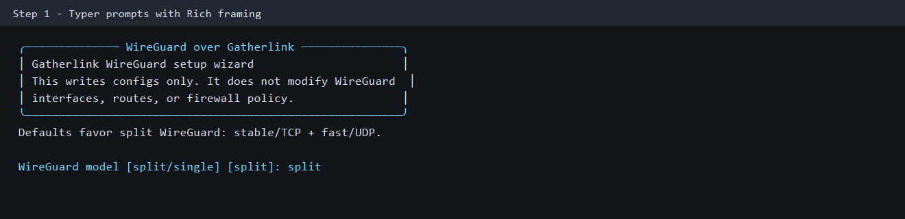
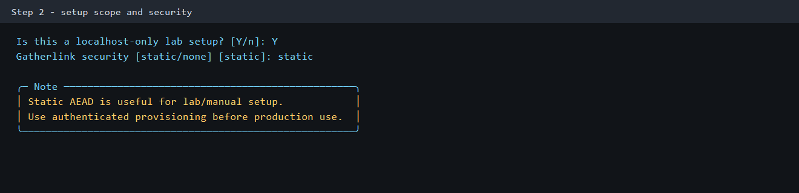
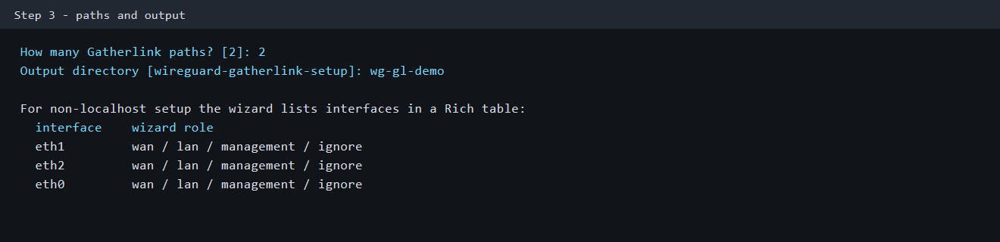
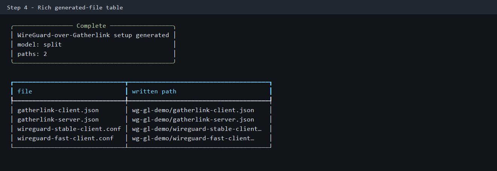
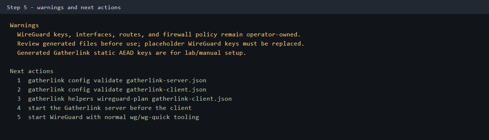
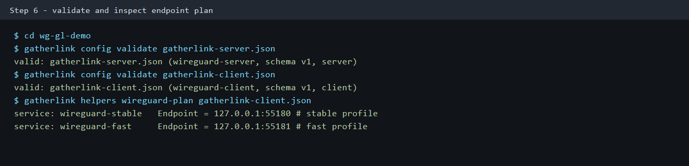

# WireGuard Over Multiple Gatherlink Paths

Use this guide when WireGuard should keep owning the VPN interface while
Gatherlink carries WireGuard UDP packets over two or more configured paths.

Start with [`docs/user/quickstart.md`](quickstart.md) if the CLI and Rust/PyO3 dataplane binding
are not installed yet.

## Easiest Path

Run the setup wizard:

```bash
gatherlink helpers wireguard-setup
```

The wizard uses normal Typer prompts, so it works in ordinary SSH terminals,
and Rich panels/tables for the navigation frame, generated-file summary,
warnings, and next actions.



The wizard asks for:

- WireGuard model: `split` or `single`
- whether this is a localhost-only lab
- how many Gatherlink paths to generate
- which discovered interfaces are WAN, LAN, management, or ignored
- the per-path carrier bind and remote endpoints for non-localhost setups
- the output directory





Default choices generate the split WireGuard profile. That profile uses one
WireGuard tunnel for TCP/default traffic and one WireGuard tunnel for
UDP/high-throughput traffic. It is the recommended performance starting point
for mixed traffic because Gatherlink does not inspect encrypted WireGuard
payloads.

## Generated Files

The default split setup writes:



- `gatherlink-client.json`
- `gatherlink-server.json`
- `wireguard-stable-client.conf`
- `wireguard-stable-server.conf`
- `wireguard-fast-client.conf`
- `wireguard-fast-server.conf`
- `traffic-split-plan.sh`
- [`README.md`](../../README.md)

The wizard then prints warnings and next actions:



The generated WireGuard files are skeletons. Replace placeholder WireGuard keys
with WireGuard-owned key material before running `wg` or `wg-quick`.

The generated Gatherlink configs use static AEAD keys by default so a first lab
can run without a separate provisioning exchange. Treat those keys as
lab/manual setup. For production, regenerate security material with the normal
authenticated provisioning flow before deployment.

## Local Lab Example

Generate a two-path localhost lab without prompts:

```bash
gatherlink helpers wireguard-setup \
  --non-interactive \
  --local-only \
  --path-count 2 \
  --output .gatherlink/wg-multipath-demo \
  --force
```

Validate the generated Gatherlink configs:

```bash
cd .gatherlink/wg-multipath-demo
gatherlink config validate gatherlink-server.json
gatherlink config validate gatherlink-client.json
gatherlink helpers wireguard-plan gatherlink-client.json
```



Start the Gatherlink side:

```bash
gatherlink run start gatherlink-server.json --name core.wg-server --scheduler-reapply-interval 5
gatherlink run start gatherlink-client.json --name core.wg-client --scheduler-reapply-interval 5
gatherlink services monitor core.wg-server core.wg-client --once
```

Then start WireGuard using your normal WireGuard tooling after replacing
placeholder keys in the generated WireGuard configs.

## Non-Localhost Paths

For a scripted two-path setup, pass explicit path endpoints:

```bash
gatherlink helpers wireguard-setup \
  --non-interactive \
  --model split \
  --path 'wan1=eth1,client_bind=10.0.1.2:56001,server_bind=10.0.1.1:57001,tx=500000000,rx=500000000' \
  --path 'wan2=eth2,client_bind=10.0.2.2:56002,server_bind=10.0.2.1:57002,tx=200000000,rx=200000000' \
  --output wg-gl-site \
  --force
```

Each `--path` is:

```text
name=interface,client_bind=HOST:PORT,server_bind=HOST:PORT[,mtu=1200][,tx=BPS][,rx=BPS]
```

The opposite-side remote endpoints are derived from the bind endpoints unless
you pass `client_remote=` or `server_remote=` explicitly.

## Model Choice

Use `split` unless you have a reason not to:

- `split`: default; two WireGuard tunnels, one stable/TCP-oriented and one
  fast/UDP-oriented
- `single`: one WireGuard tunnel over one Gatherlink service; simpler, but
  Gatherlink sees only one opaque UDP flow

For split mode, review `traffic-split-plan.sh` before applying it. It uses
Gatherlink-labeled nftables and policy-routing rules so they can be reviewed and
removed cleanly, but local firewall policy still belongs to the operator.

## MTU

Start with WireGuard MTU `1380` on normal 1500-byte underlay paths. Test `1280`
or `1200` on lossy, jittery, mobile, or satellite-like links. Do not assume a
larger WireGuard MTU is faster.

## What Gatherlink Does Not Do

Gatherlink does not:

- create WireGuard private keys for committed examples
- replace `wg`, `wg-quick`, platform network managers, or appliance tooling
- own WireGuard routes or firewall policy
- inspect WireGuard payloads to infer TCP streams
- implement WireGuard protocol behavior

Gatherlink does:

- generate Gatherlink UDP transport configs
- render WireGuard config skeletons and endpoint guidance
- provide an optional split-profile traffic plan
- validate the generated Gatherlink configs
- expose service/path counters through `gatherlink services monitor`
